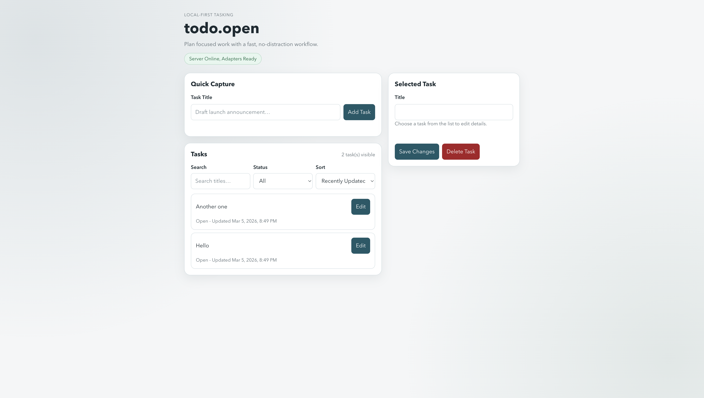

# todo.open

**A local-first task server with CLI, TUI, and web UI. Your tasks are plain JSONL on disk — no database, no lock-in.**

Think todo.txt, but with a real API, live interfaces, and an adapter system you can extend.

→ **[todo-open.pages.dev](https://justestif.github.io/todo-open)** for full docs and install instructions.

---

## Install

```sh
# npm
npm install -g @justestif/todo-open

# mise
mise use -g go:github.com/justEstif/todo-open/cmd/todoopen@latest && mise reshim

# mise (update to latest)
mise cache clear && mise use -g go:github.com/justEstif/todo-open/cmd/todoopen@latest && mise reshim

# source
git clone https://github.com/justEstif/todo-open.git
cd todo-open && go build ./cmd/todoopen ./cmd/todoopen-server
```

---

## Quick start

Start the server and open the web UI:

```sh
todoopen web
# Server listening on http://127.0.0.1:8080
```

Or use the terminal UI:

```sh
todoopen tui
# Server listening · TUI connected
```

Or just use the CLI:

```sh
todoopen task create --title "Refactor auth module" --priority high
todoopen task list
# ID          TITLE                  STATUS      PRIORITY
# task_a1b2   Refactor auth module   open        high
```

All three interfaces talk to the same local server and stay in sync via SSE.

---

## How it works

```
.todoopen/tasks.jsonl      ← plain text, yours forever
         │
   todoopen server         ← local HTTP :8080
   (REST + SSE)
         │
   ┌─────┼──────────────┬──────────┐
  CLI   web UI        TUI      adapters
       (live SSE)  (live SSE)  sync/view
```

- **Plain files** — `tasks.jsonl`, readable in any editor, `grep`-able, no database
- **Open API** — full REST + Server-Sent Events; `curl` is a valid client
- **Three UIs** — CLI, web, and a Bubble Tea TUI — all ship out of the box
- **Live updates** — web UI and TUI receive real-time task updates over SSE



---

## Adapters

Adapters extend todo.open with custom sync backends and view renderers. They're separate binaries — write them in any language.

| Adapter | Kind | What it does |
|---|---|---|
| `todoopen-adapter-sync-git` | sync | Push/pull `tasks.jsonl` to a git repo |
| `todoopen-adapter-sync-s3` | sync | Sync workspace to S3 |
| `todoopen-adapter-view-markdown` | view | Render tasks as `TASKS.md` |
| *build your own* | sync/view | Any language, any backend |

The contracts are small — implement `Name()` and one or two methods:

- **View adapters**: `RenderTasks(ctx, []Task) ([]byte, error)`
- **Sync adapters**: `Push(ctx, []Task) error` and `Pull(ctx) ([]Task, error)`

Configure in `.todoopen/config.toml`:

```toml
[adapters.git]
  bin = "todoopen-adapter-sync-git"

[adapters.git.config]
  remote = "${GIT_REMOTE}"   # env vars expanded at runtime
  branch = "main"
```

See [docs/adapters.md](docs/adapters.md) to build your own.

---

## Agent support

todo.open also has primitives for AI agent coordination — leases, heartbeats, idempotency keys — so agents can safely pick up and work on tasks without stepping on each other or on you.

```sh
# agent discovers available work
curl -s localhost:8080/v1/tasks/next

# claim with idempotency
curl -s -X POST localhost:8080/v1/tasks/{id}/claim -H 'X-Idempotency-Key: run-42'

# heartbeat to maintain lease
curl -s -X POST localhost:8080/v1/tasks/{id}/heartbeat

# complete the task
curl -s -X POST localhost:8080/v1/tasks/{id}/complete
```

An agent skill is available for one-line install:

```bash
npx skills add justestif/todo-open -g -y
```

Run `todoopen --agent-info` (or `-A`) for a machine-readable description of all endpoints and the recommended workflow.

See [docs/agent-primitives.md](docs/agent-primitives.md) for the full coordination contract.

---

## Documentation

| Doc | What it covers |
|---|---|
| [docs/api.md](docs/api.md) | Full REST + SSE API reference |
| [docs/schema.md](docs/schema.md) | Task schema, JSONL format, field definitions |
| [docs/adapters.md](docs/adapters.md) | Adapter protocol and how to build your own |
| [docs/agent-primitives.md](docs/agent-primitives.md) | Agent coordination contract |
| [docs/architecture.md](docs/architecture.md) | Internal design and package layout |
| [docs/human-ux-invariants.md](docs/human-ux-invariants.md) | Human-first UX rules and CLI contract |

---

MIT License
