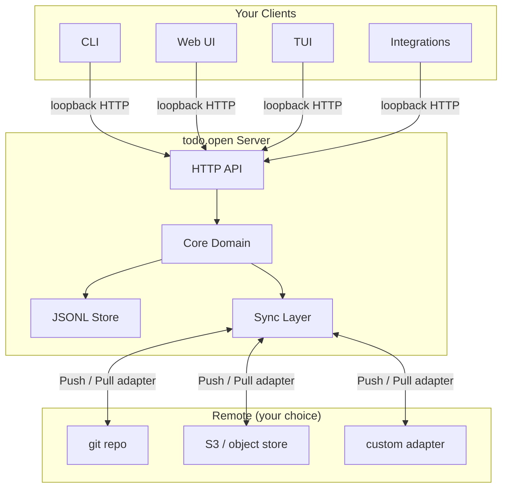

# todo.open

[](https://go.dev)
[](https://github.com/justEstif/todo-open/blob/main/docs/mvp.md)
[](https://github.com/justEstif/todo-open/blob/main/docs/schema.md)

**A local-first task platform where you own the data, the sync strategy, and the interface.**

Most task apps make the same tradeoff: great UX but your data lives on their servers, in their format, gone if they shut down. Plain-text systems like todo.txt flip this but sacrifice usability. todo.open does neither.

The core is a Go server with a portable JSONL data model and a versioned HTTP API. You run it locally. Today, the shipped API surface focuses on health checks, task CRUD, and adapter runtime status. Sync execution and reusable view endpoints are defined in docs as planned architecture, not shipped endpoints.

---

## How it works



- **Server-first**: one canonical API, all clients are just consumers
- **Local-first**: runs entirely on your machine, no cloud dependency
- **Your data**: tasks stored as plain JSONL — readable, portable, version-controllable
- **Pluggable sync**: implement a `Push`/`Pull` adapter to sync anywhere
- **Pluggable views**: implement a `RenderTasks` adapter to view your tasks in any tool

---

## Quick start

### Install via mise (recommended)

```sh
mise use -g go:github.com/justEstif/todo-open/cmd/todoopen@latest
todoopen --help
```

### Build from source

```sh
git clone https://github.com/justEstif/todo-open.git
cd todo-open
go build ./cmd/todoopen
./todoopen --help
```

---

## Usage

```sh
# Start the local server and open the web UI
todoopen web

# In another terminal — manage tasks via CLI
todoopen task create -title "Write release notes"
todoopen task list

# Inspect which adapters are active
todoopen adapters
```

Useful flags for `todoopen web`:

| Flag                    | Description                          |
| ----------------------- | ------------------------------------ |
| `--addr 127.0.0.1:8080` | Custom bind address                  |
| `--no-open`             | Start server without opening browser |
| `--server http://...`   | Attach CLI to a running server       |

---

## Bring your own sync

Sync is opt-in. The built-in default adapter is `noop`, so tasks stay local by default.

Sync adapters are part of the current runtime model: register built-ins or install plugins, then enable them in `.todoopen/meta.json`.

To add sync, implement the adapter interface:

```go
type Adapter interface {
    Name() string
    Push(ctx context.Context, tasks []core.Task) error
    Pull(ctx context.Context) ([]core.Task, error)
}
```

Then register/install your plugin and enable it in `.todoopen/meta.json`:

```json
{
  "workspace_version": 1,
  "schema_version": "todo.open.task.v1",
  "enabled_sync_adapters": ["noop", "git"],
  "adapter_plugins": [
    {"name": "git", "kind": "sync", "command": "todoopen-plugin-sync-git"}
  ],
  "ext": {
    "adapter_settings": {
      "git": { "remote": "origin", "branch": "tasks" }
    }
  }
}
```

See `docs/adapters.md` and `docs/schema.md` for plugin contract and metadata configuration details.

Example adapters you could build or contribute:

- **git** — push/pull your `tasks.jsonl` to a repo branch
- **rsync** — sync to a remote machine over SSH
- **S3** — backup to object storage
- **custom** — anything with a `Push`/`Pull` contract

Reference implementations are maintained in a separate examples repository. Git sync example: [`../todo-open-git-sync`](../todo-open-git-sync).

---

## Bring your own view

The built-in web UI is one option today. Because tasks are JSONL, you can also pipe task output into any tool:

```sh
# View with vd (visidata)
todoopen task list --json | vd -f json

# Filter and query with miller
todoopen task list --json | mlr --json filter '$status == "open"'

# Or build a TUI adapter using the view interface (contract available; API integration planned)
type Adapter interface {
    Name() string
    RenderTasks(ctx context.Context, tasks []core.Task) ([]byte, error)
}
```

View extension examples are maintained in a separate examples repository.

---

## Roadmap

- [x] Local HTTP API + core domain
- [x] CLI client
- [x] Web UI
- [x] Pluggable sync and view adapter contracts
- [ ] Git sync adapter (reference implementation)
- [ ] TUI client
- [ ] Packaged binaries (`.deb`, `.apk`, `.exe`, `.dmg`)
- [ ] Desktop app

---

## Contributing

```sh
git clone https://github.com/justEstif/todo-open.git
cd todo-open
mise install
mise run build
mise run test
```

Common tasks:

```sh
mise run fmt    # format
mise run vet    # lint
mise run test   # test
mise run build  # build
```

---

## Docs

| Doc                                          | Description                     |
| -------------------------------------------- | ------------------------------- |
| [Architecture](docs/architecture.md)         | System design and principles    |
| [Adapters](docs/adapters.md)                 | View and sync adapter contracts |
| [API](docs/api.md)                           | HTTP API reference              |
| [Schema](docs/schema.md)                     | JSONL task schema               |
| [Sync](docs/sync.md)                         | Sync design decisions           |
| [Testing](docs/testing.md)                   | Test and release strategy       |
| [Coding Standards](docs/coding-standards.md) | Code conventions                |
