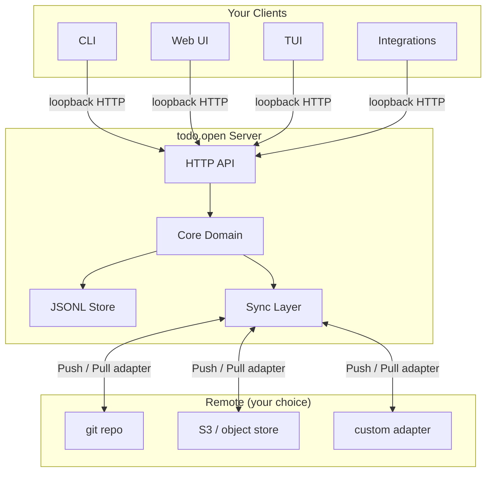

# todo.open

[](https://go.dev)
[](https://github.com/justEstif/todo-open/blob/main/docs/mvp.md)
[](https://github.com/justEstif/todo-open/blob/main/docs/schema.md)

**A local-first task runtime with a stable API contract — CLI, web, and agent-friendly.**

Most task apps lock your data on their servers — gone if they shut down. Plain-text systems like todo.txt flip this but sacrifice usability. todo.open does neither.

Run a local Go server. Store tasks as plain JSONL. Sync anywhere, view in any tool.

---

## Quick start

### Install via mise (recommended)

```sh
mise use -g go:github.com/justEstif/todo-open/cmd/todoopen@latest
todoopen --help
```

### Build from source

```sh
git clone https://github.com/justEstif/todo-open.git
cd todo-open
go build ./cmd/todoopen
./todoopen --help
```

### Verify it works

```sh
./scripts/persistence-smoke.sh
```

Creates a task, restarts the server, confirms the task survived.

---

## Usage

```sh
# Start the local server + web UI
todoopen web

# Manage tasks via CLI
todoopen task create --title "Write release notes"
todoopen task list

# Check active adapters
todoopen adapters
```

| Flag                    | Description                          |
| ----------------------- | ------------------------------------ |
| `--addr 127.0.0.1:8080` | Custom bind address                  |
| `--no-open`             | Start server without opening browser |
| `--server http://...`   | Attach CLI to a running server       |

---

## Web UI Preview


---

## Sync anywhere

Tasks stay local by default. Enable a sync adapter when you're ready.

Implement the interface:

```go
type Adapter interface {
    Name() string
    Push(ctx context.Context, tasks []core.Task) error
    Pull(ctx context.Context) ([]core.Task, error)
}
```

Enable it in `.todoopen/meta.json`:

```json
{
  "enabled_sync_adapters": ["git"],
  "adapter_plugins": [
    { "name": "git", "kind": "sync", "command": "todoopen-plugin-sync-git" }
  ]
}
```

**Adapters you could build or contribute:**

- **git** — push/pull `tasks.jsonl` to a repo branch ([reference implementation](https://github.com/justEstif/todo-open-git-sync))
- **rsync** — sync over SSH
- **S3** — backup to object storage
- **custom** — anything with a `Push`/`Pull` contract

See [adapters.md](docs/adapters.md) and [schema.md](docs/schema.md) for the full plugin contract.

---

## View in any tool

Tasks are JSONL. Pipe them anywhere:

```sh
# visidata
todoopen task list --json | vd -f json

# miller
todoopen task list --json | mlr --json filter '$status == "open"'
```

Or build a view adapter using the `RenderTasks` interface — see [adapters.md](docs/adapters.md).

---

## How it works



- **Local-first**: runs on your machine, no cloud required
- **Your data**: tasks stored as plain JSONL — readable, portable, version-controllable
- **One API**: all clients connect over loopback HTTP
- **Pluggable sync**: implement a `Push`/`Pull` adapter to sync anywhere
- **Pluggable views**: pipe JSON output to any tool, or build a view adapter

---

## Roadmap

- [x] Local HTTP API + core domain
- [x] CLI client
- [x] Web UI
- [x] Pluggable sync and view adapter contracts
- [x] Git sync adapter (reference implementation)
- [ ] Agent task coordination / real-time sync
- [ ] TUI client
- [ ] Packaged binaries (`.deb`, `.apk`, `.exe`, `.dmg`)
- [ ] Desktop app

---

## Contributing

```sh
git clone https://github.com/justEstif/todo-open.git
cd todo-open
mise install
mise run build
mise run test
```

Common tasks: `mise run fmt` · `mise run vet` · `mise run test` · `mise run build`
