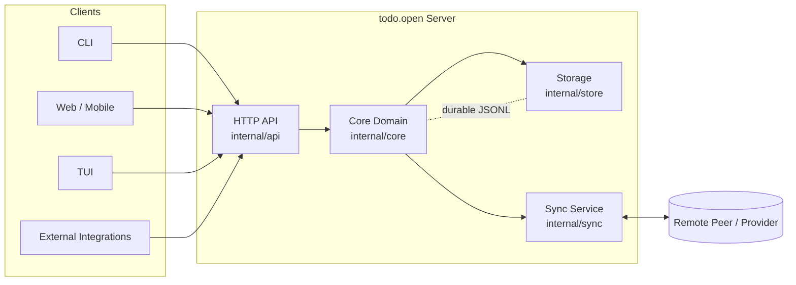

# todo.open High-Level Architecture (Server-First Vision)

## Vision

todo.open is a **server-first, local-first task platform** implemented in Go.

- The server is the primary product boundary.
- Clients (CLI, web, mobile, TUI, integrations) all consume the same API.
- Data remains user-owned and portable via JSONL-based storage contracts.

This keeps product direction centered on a stable domain and protocol, not any single interface.

---

## Architectural Principles

1. **Server-first contract**
   - API and domain semantics are canonical.
   - Client behavior should not redefine task semantics.

2. **Local-first durability**
   - Single-node operation works without cloud dependencies.
   - Sync is additive, not required for core functionality.

3. **Open data model**
   - JSONL records + schema versioning + extension namespaces.
   - Import/export and migration are first-class concerns.

4. **Composable interfaces**
   - CLI is a client of the server API.
   - Additional clients can be added without changing core domain logic.

5. **Extensible adapters**
   - Storage, sync, and view adapters are modular.

---

## Top-Level System Components

## High-Level Interaction Diagram

## 1) API Server (Go)

Responsibilities:

- Expose task CRUD/query operations
- Enforce schema and lifecycle rules
- Provide sync and adapter management endpoints
- Publish observability/health endpoints

Protocols (phased):

- MVP: local HTTP API bound to loopback (`127.0.0.1` / `localhost`) for single-user local operation
- Later: optional remote deployment mode with auth and multi-user controls

## 2) Core Domain Engine (Go package)

Responsibilities:

- Task model and validation
- State transition rules
- Query/filter/sort logic
- Conflict metadata model

This layer is transport-independent and shared by server handlers and internal jobs.

## 3) Storage Layer

Responsibilities:

- Persist canonical task records (JSONL)
- Manage metadata/index/checkpoint files
- Ensure durability (atomic writes/compaction/recovery)

Initial backend:

- Local filesystem store

Future backends:

- Embedded DB or object-store-backed variants via adapter interface

### Storage evolution policy

- JSONL remains the canonical interchange and portability format.
- Runtime persistence may evolve behind `internal/store` without API/client changes.
- Trigger evaluation for storage backend upgrade when one or more thresholds are consistently exceeded:
  - `tasks.jsonl` size > 100MB,
  - task count > 100k,
  - p95 list/query latency > 200ms in local mode,
  - compaction/recovery operations become user-visible bottlenecks.
- If thresholds are exceeded, introduce segmented JSONL or embedded DB implementation behind the same store interface while preserving import/export to canonical JSONL.

## 4) Sync Layer

Responsibilities:

- Pull/push changes via adapters
- Track sync checkpoints/tokens
- Detect and resolve conflicts with policy hooks

Initial scope:

- Minimal sync contract and one basic adapter

## 5) Clients (API Consumers)

- CLI client (first shipped client)
- Web/mobile client
- TUI client
- External integrations

All clients must consume stable server contracts rather than direct file writes.

---

## Request/Write Flow (Conceptual)

1. Client sends command/request to server API
2. Server validates input and authorization/context
3. Core engine applies business rules and state transitions
4. Storage layer commits durable change and updates metadata
5. Server emits response/events and optional sync scheduling

---

## Deployment Modes

1. **Single-user local mode (MVP default)**
   - Server runs on local machine
   - Local JSONL store
   - CLI/web interact over loopback API

2. **Hosted/self-hosted mode (later)**
   - Shared server for multiple clients/users
   - Stronger auth, policy, and operations model

---

## Go Package/Module Direction (High-Level)

- `internal/core` — domain entities, validation, transitions
- `internal/store` — persistence interfaces + filesystem implementation
- `internal/sync` — sync service + adapter contracts
- `internal/api` — HTTP handlers, request/response mapping
- `internal/app` — wiring/composition root
- `cmd/todoopen-server` — server entrypoint
- `cmd/todoopen` — CLI client entrypoint

Guideline: keep `core` independent of transport and storage implementation details.

---

## Explicit Non-Goals for First Iteration

- Full collaborative real-time editing
- Enterprise auth/permissions matrix
- Distributed consensus/event sourcing architecture

---

## Decision Summary

- **Architecture**: server-first
- **Language**: Go
- **Primary boundary**: API + domain model
- **Role of CLI**: first client, not core system boundary
